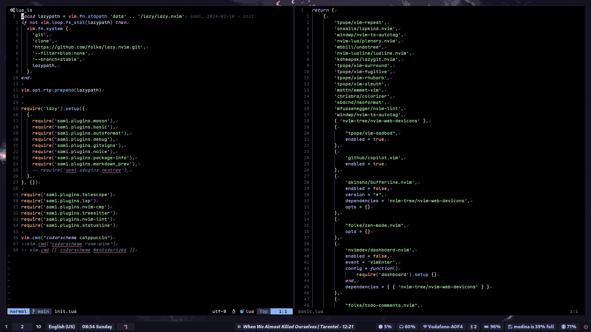
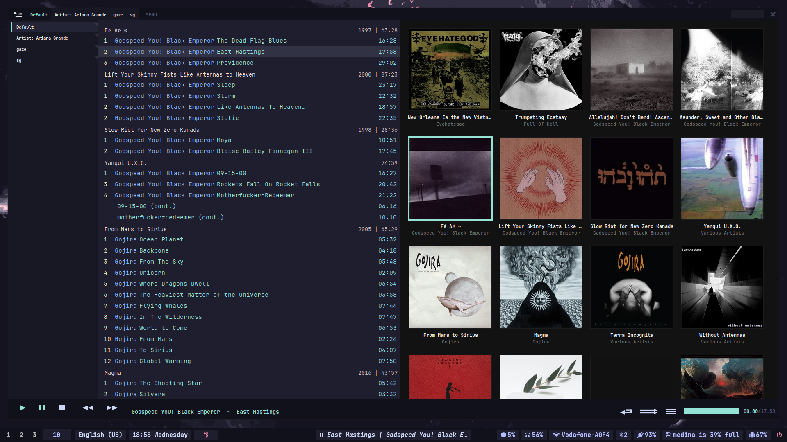

# dots :3

my hyprland dotfiles on arch linux ^^

> still needs a lot of work but still a good start.

## info

- **os**: arch linux
- **compositor**: hyprland
- **terminal**: kitty
- **font**: CaskaydiaCove Nerd Font
- **editor**: neovim
- **app launcher**: rofi
- **notifications**: dunst
- **status bar**: waybar
- **lockscreen**: waylock
